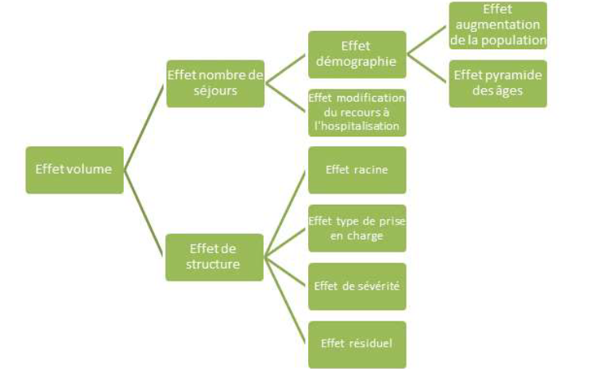

# Public Health Economics indicators for hospital activity measurement

## Table of contents
- [*MCO* activity](#mco-activity)
  - [Introduction](#introduction) 
  - [*CMD*](#cmd)
  - [*CAS*](#cas)
  - [6th character of *GHM*](#6th-character-of-ghm)
  - [*MCO* activity indicators](#mco-activity-indicators)
    - [Evolution of number of stays](#evolution-of-number-of-stays)
    - [Evolution of number of *équivalents-journées*](#evolution-of-number-of-équivalents-journées)
    - [Evolution of *volume économique*](#evolution-of-volume-économique)
    - [Holiday effect correction (*CJO*)](#holiday-effect-correction-cjo)
- [*HAD* and *SMR* activities](#had-and-smr-activities)

## *MCO* activity

### Introduction

The statistical unit to be considered in the *PMSI* for an economic analysis of *MCO* hospital activity is the intersection of a *GHM* (*Groupe homogène de malades*) and a *GHS* (*Groupe homogène de séjours*).

A *GHM* groups together cases of the same medical and economic nature and constitutes the elementary category of classification in *MCO*. Each stay is assigned to a *GHM* according to an algorithm based on the medico-administrative information contained in the *résumé de sortie standardisé* (*RSS*) of each patient.  

A *GHS* corresponds, within the framework of *T2A*, to the tariff of the *groupe homogène de malades*. The vast majority of *GHM* correspond to only a single *GHS*, meaning a single tariff. However, some *GHM* may be assigned to two or more tariffs (depending, for the same case — for the same *GHM* — on different levels of equipment, for example).  

Therefore, the statistical unit considered within the framework of *T2A MCO* is not the *GHM* itself but a *GHM* combined with a *GHS*. More particularly:  
- A *GHM* is coded in the *PMSI* by an alphanumeric sequence consisting of 6 characters, of which the first three and the last one are significant and provide information about the stay.  
  - The first two indicate the specialty of care, called *catégorie majeure de diagnostic* or *CMD*, and group 28 categories labeled from 01, 02, 03 to 28 in the section [CMD](#cmd).  
  - The third indicates the nature of the care, called *catégorie d'activité de soins* or *CAS*, and corresponds to a letter among those in the section [CAS](#cas), representing one of the 9 groups of care types (surgery, medicine, minimally invasive techniques) and length of stay (stay with or without an overnight stay).  
  - The last character indicates the complexity of the stay, its severity, or its duration, with level 1 being the lowest severity level and 4 the highest. This last character follows this [classification](#6th-character-of-ghm).

As an example, the *GHM* *08C471*, whose label is *Prothèses de hanche pour traumatismes récents, niveau 1*, indicates that it belongs to *CMD* *08* (*Affections et traumatismes de l'appareil musculosquelettique et du tissu conjonctif*), meaning orthopedics, then surgery (the third character being *C*), and finally that the severity level is low (level 1). Moreover, the middle number, *47*, is only used to sequence this *GHM* within all orthopedic surgery *GHM* in this case.  

Finally, the first five characters of the *GHM* correspond to the *racine du GHM* and group together all *GHM* of the same *CMD* and the same type of care, regardless of the severity level of the stay.  

As an example, the *GHM* *08C471* belongs to the *racine* *08C47*, along with the *GHM*: *08C472*, *08C473*, and *08C474*.

The definition of *GHS*, on the other hand, is based on an average valuation concept assessed in relation to costs and public health plans, a concept adapted in view of concrete situations such as:  

- differences in length of stay (*EXB* or *EXH* stays corresponding respectively to very short or very long durations relative to the *GHM*)  
- differences in the complexity of care due to admission to a specialized unit (intensive care, high-dependency care, continuous monitoring, neonatology), leading to the creation of additional daily supplements  
- expensive drugs from the additional list (*molécules onéreuses de la liste en sus*)
- etc.

The *GHM* and *GHS* make it possible to measure hospital activity and manage their performance and resources according to the hospital *casemix*.  

Each *GHM-GHS* pair is thus associated for each year $n$ with:  
- a number of stays or sessions: sessions are usually excluded from the scope for calculating hospital activity and only stays are included and denoted $q_{GHM, GHS, n}$
- a number of days  
- a type of hospitalization:  
  - full hospitalization (*HC*): when the stay required at least one overnight stay  
  - outpatient hospitalization (*HP*): when the stay did not require an overnight stay  
- an average length of stay (*DMS*), corresponding to the ratio of the number of days to the number of stays, and defined only for *HC* stays, denoted $DMS_{GHM, GHS, n}$
- an average price denoted $p_{GHM, GHS, n}$

### *CMD*

The *CMD* most often correspond to a functional system (nervous system disorders, eye disorders, respiratory system disorders, etc.); they are subdivided into *racines de GHM*, which are themselves subdivided into *GHM*.  

|CMD    |Label    |
|-------|---------|
|01|Affections du système nerveux|
|02|Affections de l'oeil|
|03|Affections des oreilles, du nez, de la gorge, de la bouche et des dents|
|04|Affections de l'appareil respiratoire|
|05|Affections de l'appareil circulatoire|
|06|Affections du tube digestif|
|07|Affections du système hépatobiliaire et du pancréas|
|08|Affections et traumatismes de l'appareil musculosquelettique et du tissu conjonctif|
|09|Affections de la peau, des tissus sous-cutanés et des seins|
|10|Affections endocriniennes, métaboliques et nutritionnelles|
|11|Affections du rein et des voies urinaires|
|12|Affections de l'appareil génital masculin|
|13|Affections de l'appareil génital féminin|
|14|Grossesses pathologiques, accouchements et affections du post-partum|
|15|Nouveau-nés, prématurés et affections de la période périnatale|
|16|Affections du sang et des organes hématopoïétiques|
|17|Affections myéloprolifératives et tumeurs de siège imprécis ou diffus et/ou CMA|
|18|Maladies infectieuses et parasitaires|
|19|Maladies et troubles mentaux|
|20|Troubles mentaux organiques liés à l'absorption de drogues ou induits par celles-ci|
|21|Traumatismes, allergies et empoisonnements|
|22|Brûlures|
|23|Facteurs influant sur l'état de santé et autres motifs de recours aux services de santé|
|24|Séjours de moins de 2 jours|
|25|Maladies dues à une infection par le VIH|
|26|Traumatismes multiples graves|
|27|Transplantations d'organes|
|28|Séances|
|90|Erreurs et autres séjours inclassables|

### *CAS*

The *CAS* of a stay is determined based on the duration of the stay and the type of care according to one of the following groups:

|CAS    |Label    |
|-------|---------|
|C|Chirurgie non ambulatoire|
|C|Chirurgie ambulatoire|
|O|Obstétrique-mère|
|N|Obstétrique-enfant|
|K|Techniques peu invasives|
|S|Séances|
|X|Séjours sans acte classant sans nuitée - médecine notamment|
|X| Séjours sans acte classant d'au moins une nuit - médecine notamment|
|Z| Séjours inclassables|

### 6th character of *GHM*

The 6th character of a *GHM* is significant and is associated to a level of severity of the hospital stay. The *racine de GHM* can be found by excluding this last character from the *GHM*.

|6th character of *GHM*    |Label    |
|------------------|---------|
|1 or A|Niveaux de sévérité 1 ou A|
|2 or B|Niveaux de sévérité 2 ou B|
|3 or C|Niveaux de sévérité 3 ou C|
|4 or D|Niveaux de sévérité 4 ou D|
|J|Séjours en ambulatoire|
|T|Séjours de très courte durée|
|Z|Séjours sans niveau de sévérité|
|E|Séjours avec décès|

### *MCO* activity indicators

Three different measures have been selected to analyze activity in the field of *MCO* stays:  

- [**The number of stays in full hospitalization and outpatient care**](#evolution-of-number-of-stays): This is the simplest measure of hospital activity. A stay refers to the period during which a patient is hospitalized.

- [**The number of équivalents-journées**](#evolution-of-number-of-équivalents-journées): This measure synthesizes the evolution of activity associated with full hospitalizations and outpatient hospitalizations (an outpatient stay is valued as one day), taking into account the length of stays. This "physical" measure of activity has the advantage of being easily interpretable. It is notably used by the Directorate for Research, Studies, Evaluation, and Statistics (*DREES*) in its annual overview of healthcare facilities.  

- [The **volume économique**](#evolution-of-volume-économique): This corresponds to activity-related revenues based on the rates associated with each category of stays, adjusted to neutralize the "price effects" caused by the annual revaluation of these rates. While the evolution of the number of equivalent days is a concrete and simple indicator to calculate, it does not account for differences in costs and, therefore, in health insurance revenues related to hospitalization days depending on the treated pathologies. The *volume économique* aims to factor in these structural effects: the activity volume is thus calculated as the number of stays weighted by a coefficient representing their cost for health insurance. It does not reflect the "actual" revenues of healthcare facilities, which benefit from annual price effects linked to the revaluation of these rates. An identical rate is applied between former DG and former OQN establishments to make their *volume économique* comparable.  

#### Evolution of number of stays

Hospital activity in *MCO* excluding sessions in public and private healthcare facilities can first be measured based on the number of stays, whether carried out on an outpatient basis or as full hospitalization. This number can be considered an indicator of the total number of patients treated by healthcare facilities. The evolution of the activity between years $n-1$ and $n$ can then be computed using the evolution of the number of stays between $n-1$ and $n$ : $\boxed{\sum_{GHM, GHS}\frac{q_{GHM, GHS, n}}{q_{GHM, GHS, n-1}}-1}$

However, this indicator does not take into account changes in the average length of stay (*DMS*) or the difference in duration between outpatient care and full hospitalization.

#### Evolution of number of *équivalents-journées*

Hospital activity in *MCO* can then be measured by the number of days spent in the hospital through the number of *équivalents-journées*. This indicator measures, on one hand, the number of days in full hospitalization (*HC*) and, on the other hand, the number of stays in partial hospitalization (*HP*). This indicator is calculated for year $n$, for each *GHM* and then aggregated as follows: $équivalents-journées_{n} = $

$\boxed{\sum_{GHM, GHS}\frac{q_{GHM, GHS, n} \times DMS_{GHM, GHS, n}}{q_{GHM, GHS, n-1} \times DMS_{GHM, GHS, n-1}}-1}$

#### Evolution of *volume économique*

The *MCO* activity can be characterized by a "volume" indicator that considers the weight of each stay based on the pathology treated, unaffected by variations in stay rates from one year to another. The *volume économique* is calculated on the scope of *MCO* stays, excluding sessions. This indicator, called "*volume économique*," allows for a more precise measurement of activity by considering a greater number of characteristics of the stay than just the duration.

The analysis of the evolution of the *volume économique* presents two advantages compared to that of the number of equivalent days or stays:
- it allows measuring activity while considering the evolution of the intensity of a day of care, particularly by taking into account the severity of the cases treated and the diagnoses managed
- it allows getting closer to the evolution of the health insurance revenues received by the establishment. Indeed, the *volume économique* corresponds to the valuation by health insurance of stays at a constant rate

The *volume économique* is equal to the number of stays weighted by the economic weight of each *GHM-GHS* based on the average price of stays in this category. For example, for an average observed price in the reference year $n_{ref}$, the *volume économique* for the year $n$ is given by: $volume \ \ economique_{n} = \sum_{GHM, GHS} p_{GHM, GHS, n_{ref}} \times q_{GHM, GHS, n}$ , where $p_{GHM, GHS, n_{ref}}$ is the average price for stays associated with $GHM-GHS$ on the reference years $n_{ref}$ and $q_{GHM, GHS, n}$ is the number of stays for the year $n$ and each pair *GHM-GHS*.

This average price is usually calculated exclusively for the scope of *EPS* (*Etablissements Publics de Santé*), a scope for which the *MCO* databases (such as *DIAMANT*), provide valuation data from health insurance (*Assurance Maladie*). This average price is used to assess the stays of all public and private establishments in order to calculate their **volume économique**. This average price for a *GHM-GHS* is then given by : $p_{GHM, GHS, n_{ref}} = \frac{1}{q_{GHM, GHS, n_{ref}}} \times \frac{v_{GHM, GHS, n_{ref}}}{\tau_{GHM, GHS, n_{ref}}}$ , where :
- $q_{GHM, GHS, n_{ref}}$ is the number of stays for reference year $n_{ref}$ for the pair *GHM-GHS* in the *EPS* scope
- $v_{GHM, GHS, n_{ref}}$ is the valuation by health insurance of stays in year $n_{ref}$ for the pair *GHM-GHS* in the *EPS* scope
- $\tau_{GHM, GHS, n_{ref}}$ is the reimbursement rate by health insurance of stays in year $n_{ref}$ for the pair *GHM-GHS* in the *EPS* scope

The evolution of the hospital activity between years $n-1$ and $n$, called *effet volume*, can thus be given by the following :
$$\boxed{effet \\ volume_{n} = \sum_{GHM, GHS}\frac{p_{GHM, GHS, n_{ref}} \times q_{GHM, GHS, n}}{p_{GHM, GHS, n_{ref}} \times q_{GHM, GHS, n-1}}-1}$$

This yearly evolution breaks down into two terms : 
$\boxed{effet \\ volume_{n} = effet \ \ nombre \ \ de \ \ séjours_{n} + effet \ \ structure_{n}}$

The *effet nombre de séjours* corresponds to the annual change in the number of stays (excluding sessions), while the *effet structure* measures the year-over-year change in the hospital case mix, assuming a constant number of stays. It thus corresponds to the change in the average valuation associated with a stay. Here, the case mix refers to the distribution of stays based on their severity (1, 2, 3, ...), diagnosis (*racine de GHM*), or type of care (*HC* or *HP*). Those two components of the evolution of *volumen économique*, *effet nombre de séjours* et *effet structure*, can both be broken down.

- The *effet nombre de séjours* is given by : $\boxed{effet \ \ nombre \ \ de \ \ séjours_{n} = \frac{\sum_{GHM, GHS}q_{GHM, GHS, n}}{\sum_{GHM, GHS}q_{GHM, GHS, n-1}}-1}$ and it can be broken down into two sub-effects: $\boxed{effet \ \ nombre \ \ de \ \ séjours_{n} = effet \ \ démographie_{n} + effet \ \ modification \ \ du \ \ recours \ \ à \ \ l'hospitalisation_{n}}$ where *effet démographie* corresponds to the change in the number of stays induced by variations in the population of each age group, assuming a constant hospitalization rate per age group. The *effet modification du recours à l'hospitalisation* measures the change in *volume économique* induced by a variation in hospitalization rates per age group, given a fixed population.
  - The *effet démographie* can also be broken down into two components: $\boxed{effet \ \ démographie_{n} = effet \ \ augmentation \ \ de \ \ la \ \ population_{n} + effet \ \ pyramide \ \ des \ \ âges_{n}}$ , where the *effet augmentation de la population* corresponds to the increase in *volume économique* induced by a rise in the French population. The *effet pyramides des âges* measures the evolution of *volume économique* induced by a distortion of the age pyramid with a constant population. Indeed, the admission rate differs from one age group to another and increases with age. An aging population, without a change in the total population, results in an increase in the number of stays and, therefore, the *volume économique*, through an age pyramid effect called *effet pyramide des âges*. The different sub-effects are computed using the age classes of the patients
  
      - *effet augmentation de la population*: $\boxed{effet \\ augmentation \\ de \\ la \\ population_{n} = \frac{\sum_{i \in age \\ class} pop_{i, n}}{\sum_{i \in age \\ class} pop_{i, n-1}}-1}$
  
      - *effet pyramide des âges* (where $pop_{T, n}$ is the total population at year $n$): $\boxed{effet \\ pyramide \\ des \\ âges_{n} = \frac{\sum_{i \in age \\ class} \frac{q_{i, n-1}}{pop_{i, n-1}} \frac{pop_{i, n}}{pop_{T, n}}}{\sum_{i \in age \\ class} \frac{q_{i, n-1}}{pop_{i, n-1}} \frac{pop_{i, n-1}}{pop_{T, n-1}}}-1}$
  
  - The *effet modification du recours à l'hospitalisation*: $\boxed{effet \\ modification \\ du \\ recours \\ à \ l'hospitalisation_{n} = \frac{\sum_{i \in age \\ class} \frac{q_{i, n}}{pop_{i, n}} \times pop_{i, n}}{\sum_{i \in age \\ class} \frac{q_{i, n-1}}{pop_{i, n-1}} \times pop_{i, n}}-1}$

- The *effet structure* $\boxed{effet \\ structure_{n} = effet \\ volume_{n} - effet \\ nombre \\ de \\ séjours_{n}}$ and can also be broken down into four sub-effects: $\boxed{effet \ \ structure_{n} = effet \ \ racine_{n} + effet \ \ bascule \\ vers \\ l'ambulatoire_{n} + effet \ \ sévérité_{n} + effet \ \ résiduel_{n}}$ , where the three first effects measure the distortions in the casemix resulting from, respectively, the changes in the distribution of stays by *racine de GHM*, the shift towards outpatient care (*HP*) and the shift towards stays corresponding to more severe health conditions. However, the sum of these three effects is not necessarily equal to the *effet structure*, because of correlations between sub-effects, resulting in a residual effect denoted *effet résiduel*. However, this decomposition allows to identify the main contributors to the *effet structure* and establish a link with the underlying evolution of hospital activity. The different effects are given by :
  
  - *effet racine*: $\boxed{effet \\ racine_{n} = \frac{\sum_{racine} p_{racine, n_{ref}} \times \frac{q_{racine, n}}{\sum_{racine} q_{racine, n}}}{\sum_{racine} p_{racine, n_{ref}} \times \frac{q_{racine, n-1}}{\sum_{racine} q_{racine, n-1}}}-1}$
    
  - *effet bascule vers l'ambulatoire*: $\boxed{effet \\ bascule \\ vers \\ l'ambulatoire_{n} = \frac{\sum_{k \in HC, HP} p_{k, n_{ref}} \times \frac{q_{k, n}}{\sum_{k \in HC, HP} q_{k, n}}}{\sum_{k \in HC, HP} p_{k , n_{ref}} \times \frac{q_{k, n-1}}{\sum_{k \in HC, HP} q_{k, n-1}}}-1}$
    
  - *effet sévérité*: $\boxed{effet \\ sévérité_{n} = \frac{\sum_{sévérité} p_{sévérité, n_{ref}} \times \frac{q_{sévérité, n}}{\sum_{sévérité} q_{sévérité, n}}}{\sum_{sévérité} p_{sévérité, n_{ref}} \times \frac{q_{sévérité, n-1}}{\sum_{sévérité} q_{sévérité, n-1}}}-1}$
    
  - *effet résiduel*: $\boxed{effet \\ résiduel_{n} = effet \\ structure_{n} - (effet \\ racine_{n} + effet \\ bascule \\ vers \\ l'ambulatoire_{n} + effet \\ sévérité_{n})}$

Thus, the evolution of the *volume économique* can be decomposed into seven distinct sub-effects:
- *effet augmentation de la population*
- *effet pyramide des âges*
- *effet modification du recours à l'hospitalisation*
- *effet racine*
- *effet bascule vers l'ambulatoire*
- *effet sévérité*
- *effet résiduel*
  

#### Holiday effect correction (*CJO*)

A working-day adjustment is applied to the change in the number of stays, *équivalents-journées* and *volume économique*, to obtain comparable data from one year to another, regardless of the number of working and non-working days (weekends and public holidays) in a given period.

Indeed, according to studies conducted by *ATIH*, hospital activity on a non-working day represents 34 % of the average activity on a working day in terms of number of stays and number of *équivalents-journées*, and 49 % of the average activity on a working day in terms of *volume économique*. The working-day adjustment, or *effet CJO*, applied to the evolution of the number of stays, the evolution of the number of *équivalents-journées* or the *effet volume économique*, for a year $n$, is given by: $\boxed{effet \\ CJO_{n} = \frac{Jours \\ d'activité_{n}}{Jours \\ d'activité_{n-1}}-1}$ , where $\boxed{Jours \\ d'activité_{n} = Nombre \\ jours \\ ouvrés_{n} + \alpha \times Nombre \\ jours \\ non \\ ouvrés_{n}}$, $\alpha$ being 34 % for adjusting evolution of numbers of stays and *équivalents-journées* and 49 % for adjusting *effet volume économique*, and $Nombre \\ jours \\ ouvrés_{n}$ and $Nombre \\ jours \\ non \\ ouvrés_{n}$ are the numbers of working days and non working days respectively for year $n$.

We can then define for example adjusted *effet volume économique* : $\boxed{effet \\ volume \\ CJO_{n} = effet \\ volume_{n} - effet \\ CJO_{n}}$

## *HAD* and *SMR* activities
